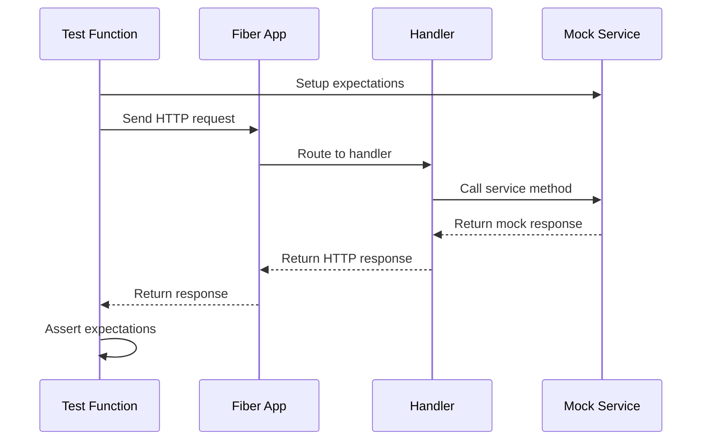

# Design Document: Handler Unit Tests

## Overview

This design specifies the implementation of comprehensive unit tests for all REST API handlers using Go's table-driven test pattern. The tests will use `httptest` for HTTP request/response simulation and `testify` for assertions and mocking.

## Architecture

The testing architecture follows a layered approach:

```
┌─────────────────────────────────────────┐
│           Test Functions                │
│  (TestAuthHandler_Login, etc.)          │
├─────────────────────────────────────────┤
│         Table-Driven Test Cases         │
│  ([]struct with name, setup, expect)    │
├─────────────────────────────────────────┤
│           Test Helpers                  │
│  (setupTestApp, createRequest, etc.)    │
├─────────────────────────────────────────┤
│           Mock Services                 │
│  (MockAuthService, MockUserService)     │
└─────────────────────────────────────────┘
```

## Components and Interfaces

### Mock Services

#### MockAuthService

```go
type MockAuthService struct {
    mock.Mock
}

func (m *MockAuthService) Login(ctx context.Context, input *service.LoginInput) (*service.AuthResponse, error) {
    args := m.Called(ctx, input)
    if args.Get(0) == nil {
        return nil, args.Error(1)
    }
    return args.Get(0).(*service.AuthResponse), args.Error(1)
}
```

#### MockUserService

Already exists in `user_handler_test.go` - will be reused.

### Test Helper Functions

```go
// setupAuthTestApp creates a Fiber app with auth routes for testing
func setupAuthTestApp(handler *AuthHandler) *fiber.App

// setupUserTestApp creates a Fiber app with user routes for testing  
func setupUserTestApp(handler *UserHandler) *fiber.App

// createJSONRequest creates an HTTP request with JSON body
func createJSONRequest(method, path string, body interface{}) *http.Request

// parseResponse parses the JSON response body
func parseResponse(resp *http.Response) (*response.Response, error)
```

### Table-Driven Test Structure

```go
type testCase struct {
    name           string
    setupMock      func(*MockService)
    requestBody    interface{}
    expectedStatus int
    expectedError  string
    checkResponse  func(*testing.T, *response.Response)
}
```

## Data Models

### Test Case Structure

| Field | Type | Description |
|-------|------|-------------|
| name | string | Descriptive name for the test case |
| setupMock | func | Function to configure mock expectations |
| requestBody | interface{} | Request payload (nil for GET/DELETE) |
| expectedStatus | int | Expected HTTP status code |
| expectedError | string | Expected error message (if any) |
| checkResponse | func | Custom response validation function |

### Request/Response Flow



## Correctness Properties

*A property is a characteristic or behavior that should hold true across all valid executions of a system—essentially, a formal statement about what the system should do. Properties serve as the bridge between human-readable specifications and machine-verifiable correctness guarantees.*

### Property 1: Validation Rejection Consistency

*For any* invalid input submitted to a validation-enabled endpoint (login, create user, update user), the handler SHALL return HTTP 422 status with validation errors.

**Validates: Requirements 1.3, 3.3, 6.3**

### Property 2: Pagination Parameter Normalization

*For any* pagination parameter outside the valid range (page < 1, per_page < 1 or per_page > 100), the handler SHALL normalize to default values (page=1, per_page=10) and return successful results.

**Validates: Requirements 5.3, 5.4**

## Error Handling

### HTTP Status Code Mapping

| Scenario | Status Code | Response |
|----------|-------------|----------|
| Success | 200/201/204 | Data or empty |
| Invalid JSON | 400 | "Invalid request body" |
| Validation failure | 422 | Validation errors array |
| Not found | 404 | "user not found" |
| Invalid credentials | 401 | "Invalid email or password" |
| Service error | 500 | Generic error message |

### Mock Error Simulation

```go
// Simulate service errors
mockService.On("Method", mock.Anything).Return(nil, errors.New("unexpected error"))

// Simulate domain errors
mockService.On("FindByID", mock.Anything, "invalid-id").Return(nil, service.ErrUserNotFound)
```

## Testing Strategy

### Unit Tests

Unit tests will verify specific examples and edge cases for each handler endpoint:

- **Auth Handler**: 7 test cases (Login: 5, Me: 2)
  - Login: success (1.1), invalid JSON (1.2), validation failure (1.3), invalid credentials (1.4), service error (1.5)
  - Me: authenticated request (2.1), context values (2.2)
- **User Handler**: 21 test cases (Create: 5, FindByID: 3, FindAll: 5, Update: 5, Delete: 3)
  - Create: success (3.1), invalid JSON (3.2), validation failure (3.3), duplicate email (3.4), service error (3.5)
  - FindByID: success (4.1), not found (4.2), service error (4.3)
  - FindAll: default pagination (5.1), custom pagination (5.2), invalid page (5.3), invalid per_page (5.4), service error (5.5)
  - Update: success (6.1), invalid JSON (6.2), validation failure (6.3), not found (6.4), service error (6.5)
  - Delete: success (7.1), not found (7.2), service error (7.3)

### Property-Based Tests

Property-based tests will verify universal properties across generated inputs:

- **Validation Property**: Generate various invalid inputs and verify 422 response
- **Pagination Property**: Generate out-of-range pagination values and verify normalization

### Test Configuration

- Use `testify/assert` for assertions (Requirement 8.3)
- Use `testify/mock` for service mocking (Requirement 8.3)
- Use `httptest` for HTTP request/response simulation
- Each test case creates fresh mock instances for isolation (Requirement 8.4)
- Table-driven pattern for all test functions (Requirement 8.1, 8.2)

### Table-Driven Test Pattern Requirements

The test suite follows strict table-driven test conventions per Requirement 8:

1. **Test Case Structure (8.1)**: All test cases defined as slice of structs containing:
   - `name`: Descriptive test case name
   - `setupMock`: Function to configure mock expectations
   - `requestBody`: Request payload builder
   - `expectedStatus`: Expected HTTP status code
   - `checkResponse`: Custom assertion function

2. **Subtest Execution (8.2)**: Each test case executed via `t.Run(tt.name, func(t *testing.T) {...})`

3. **Assertion Libraries (8.3)**: 
   - `testify/assert` for all assertions
   - `testify/mock` for service mocking

4. **Test Isolation (8.4)**: Fresh mock instances created per test case to ensure isolation

### Test File Organization

```
internal/handler/
├── auth_handler.go
├── auth_handler_test.go      # Auth handler tests
├── user_handler.go
└── user_handler_test.go      # Refactor existing to table-driven
```

### Example Table-Driven Test

```go
func TestAuthHandler_Login(t *testing.T) {
    tests := []struct {
        name           string
        setupMock      func(*MockAuthService)
        body           interface{}
        expectedStatus int
        checkResponse  func(*testing.T, map[string]interface{})
    }{
        {
            name: "success",
            setupMock: func(m *MockAuthService) {
                m.On("Login", mock.Anything, mock.AnythingOfType("*service.LoginInput")).
                    Return(&service.AuthResponse{Token: "jwt-token"}, nil)
            },
            body:           map[string]string{"email": "test@example.com", "password": "password123"},
            expectedStatus: fiber.StatusOK,
            checkResponse: func(t *testing.T, data map[string]interface{}) {
                assert.NotEmpty(t, data["token"])
            },
        },
        // ... more test cases
    }

    for _, tt := range tests {
        t.Run(tt.name, func(t *testing.T) {
            mockService := new(MockAuthService)
            if tt.setupMock != nil {
                tt.setupMock(mockService)
            }
            // ... execute test
        })
    }
}
```

